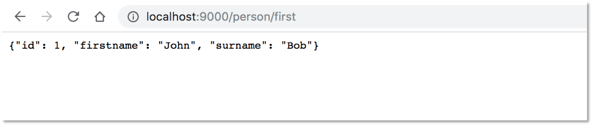
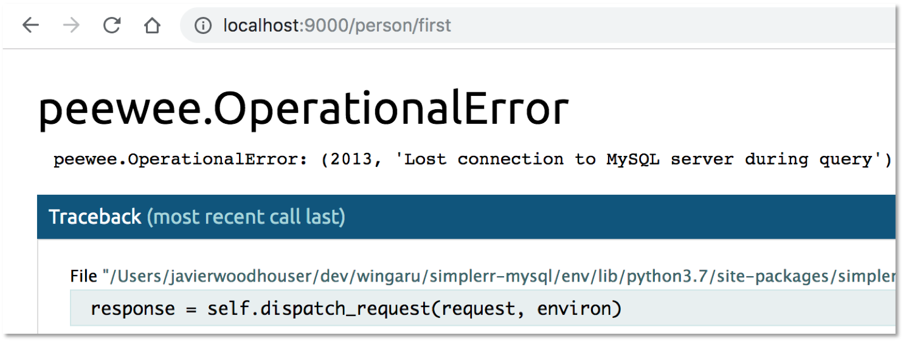

# Summary

Connection strategies for MySQL - robust, simple - but no pooling. If you need
pooling can find it in another project which goes into further detail.

# Initial steps

To run this project you must first create the following user and schema.

    $ mysql -u root -p

    mysql> -- Create user with password
    mysql> CREATE USER 'simplerr'@'127.0.0.1' IDENTIFIED BY 'pick-password';

    mysql> -- Give them some rights - because were going to be testing the stopping
    mysql> -- of connections we're going with admin level rights here
    mysql> GRANT ALL ON *.* TO 'simplerr'@'127.0.0.1' WITH GRANT OPTION;

    mysql> -- Reload grants table without restarting mysql
    mysql> FLUSH PRIVILEGES;

    mysql> -- Create the schema
    mysql> CREATE DB simplerr_schema;

# Setup your project

The mysqlclient driver is the preffered database connector for use with
simplerr, in extensive testing it has proven to run well in multiple systems,
run consistently and updates are frequent.

    $ python3 -m venv env
    $ source env/bin/activate
    (env)$ pip install mysqlclient simplerr

# Create a config file

Create a config file to host our database settings. We'll store the connection
information in module vairables for use in testing pooled connections later.

    # file: website/config.py
    from peewee import MySQLDatabase

    DB = MySQLDatabase(
        'simplerr_schema',
        user='simplerr',
        password='pick-password',
        host='127.0.0.1',
        port=3306
    )

# Create a basic page

    # file: website/index.py
    ...
    @web('/person/all')
    def person_api(request):
        return Person.select()

    @web('/person/first')
    def person_first(request):
        return Person.select().get()

# Review the output

If all is successful you should get the following when going to `/person/first`

# How does this break?

However, this can be easily broken - the connection can time out as happens in
long running sites, a developer may accidently close the connection, and
others. We can similute these events by stopping the connection from mysql.

    mysql> show processlist;
    +----+----------+-----------------+-----------------+---------+--------+----------+------------------+
    | Id | User     | Host            | db              | Command | Time   | State    | Info             |
    +----+----------+-----------------+-----------------+---------+--------+----------+------------------+
    | 26 | simplerr | localhost:56061 | simplerr_schema | Query   |      0 | starting | show processlist |
    | 30 | simplerr | localhost:61455 | simplerr_schema | Sleep   |      9 |          | NULL             |
    +----+----------+-----------------+-----------------+---------+--------+----------+------------------+
    3 rows in set (0.00 sec)

    mysql> kill 30;
    Query OK, 0 rows affected (0.00 sec)

# So how do we fix this?

This needs to be fixed at the application level. We hook into each request
before an after. We need to add a minimal try/except as errors on the route
may cause the connection to fail to close.

    #file: serve.py
    ....

    def connect(request):
        try: DB.connect()
        except: print("unexpected error in connecting to database")

    def close(request, response):
        DB.close()

    ...

    wsgi = dispatcher.wsgi(site)
    wsgi.global_events.on_pre_response(connect)
    wsgi.global_events.on_post_response(close)

    wsgi.serve()

# En Conclusión

Thats it, for a basic website that may be all you need to do. Check out the
pooled connection repo for how to handle sites with more loads, and why the
design here may have some flaws - although adminittedly simplicity is not one
of them.
